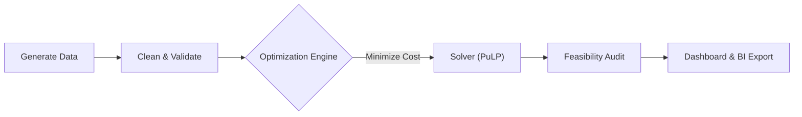

# 📦 Automated Fulfillment Center Simulation
  

### 📋 Executive Summary
An end-to-end data engineering pipeline that optimizes worker schedules to minimize daily labor costs. The system features a custom Linear Programming model, automated physical feasibility auditing (Safety Checks), and a seamless handoff to Business Intelligence tools.

---

### 🚀 Business Value
* **Cost Minimization:** Reduces labor costs by assigning orders to the most cost-efficient worker type (Robot vs. Human) using **Linear Optimization**.
* **Risk Mitigation:** Automatically detects "Operational Drift" and safety violations (e.g., Robots carrying overweight items) via a **Statistical Audit Layer**.
* **Automated Reporting:** Transforms raw logs into executive dashboards and BI-ready datasets with a single "One-Click" execution command.

---

### 🛠️ Tech Stack
* **Language:** Python 3.10+
* **Optimization:** PuLP (Linear Programming)
* **Data Engineering:** Pandas, NumPy, SQLite
* **Visualization:** Matplotlib, Seaborn
* **Orchestration:** Subprocess & Custom Logging

---

### 🏗️ Pipeline Architecture

The system follows a strict modular ETL pipeline:



1.  **Generate Data:** Simulates 8 hours of order traffic (950+ orders) with realistic weight/item correlations.
2.  **Clean & Validate:** Sanitizes raw inputs and creates SQL Views to serve as the "Source of Truth."
3.  **Optimize:** Solves a Linear Programming problem to assign workers based on Speed ($/hr) and Wage ($/hr).
4.  **Audit:** Performs a post-optimization "Safety Check" to flag physical constraints (e.g., Weight Limits).
5.  **Report:** Generates a static PNG dashboard for engineers and a clean CSV for Tableau/Power BI.

---

### ⚙️ How to Run

**1. Clone the Repository**
```bash
git clone [https://github.com/yourusername/fulfillment-simulation.git](https://github.com/yourusername/fulfillment-simulation.git)
cd fulfillment-simulation
```

**2. Install Dependencies**
```bash
pip install pandas numpy pulp matplotlib seaborn
```

**3. Execute the Pipeline**
Run the master driver to simulate a full day of operations:
```bash
python src/main.py
```

**4. View Results**
* **Engineering Report:** `reports/dashboard.png`
* **BI Dataset:** `data/bi_exports/fulfillment_bi_data.csv`
* **Logs:** `pipeline.log`

---

### 📊 Key Insight: The "Safety Gap"
While the optimization model successfully minimized costs by heavily utilizing the **Robot** workforce, the **Safety Audit (Day 4.5)** revealed a critical operational risk.

* **The Finding:** The solver assigned heavy loads (>20kg) to Robots to save money.
* **The Evidence:** The "Safety Audit" Box Plot (in `dashboard.png`) shows Robot assignments far exceeding the hypothetical 5kg safety limit.
* **Conclusion:** Pure cost minimization is insufficient; future iterations must include hard weight constraints in the LP model.

---

### 📂 File Structure
```text
├── data/                   # SQLite database and CSV exports
├── reports/                # Generated PNG Dashboards
├── src/
│   ├── main.py             # Master Pipeline Driver
│   ├── generate_data.py    # Synthetic Data Generator
│   ├── clean_data.py       # SQL ETL Scripts
│   ├── optimize_logistics.py # Linear Programming Logic
│   ├── visualize_logistics.py # Static Reporting
│   └── export_for_bi.py    # BI Handoff Script
└── README.md
```